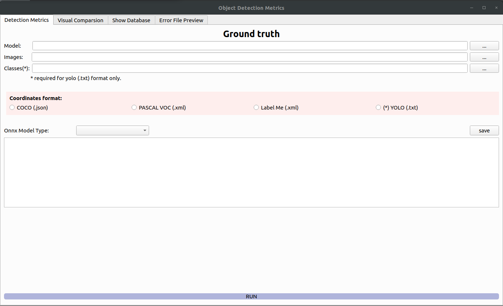
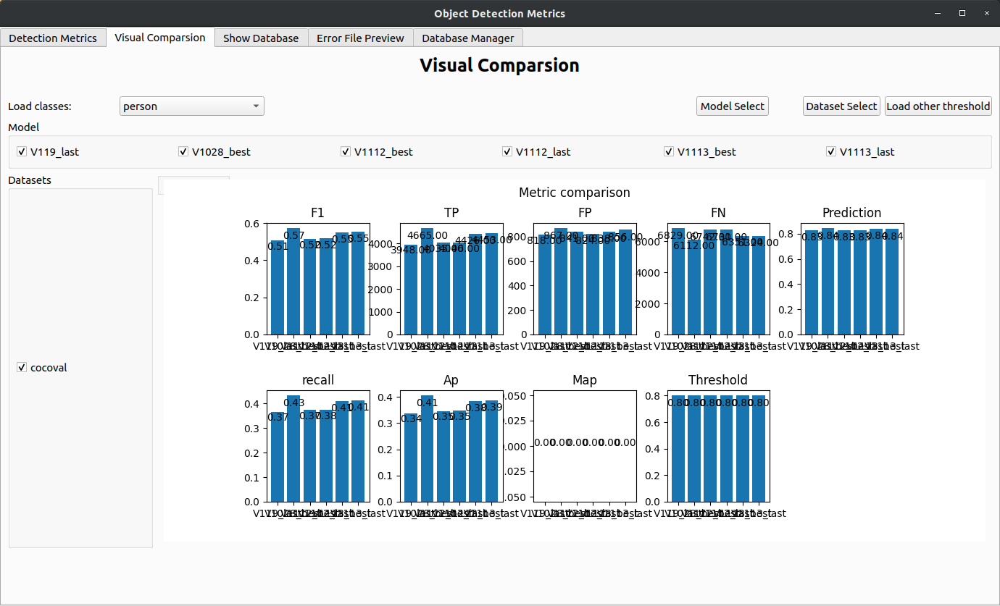
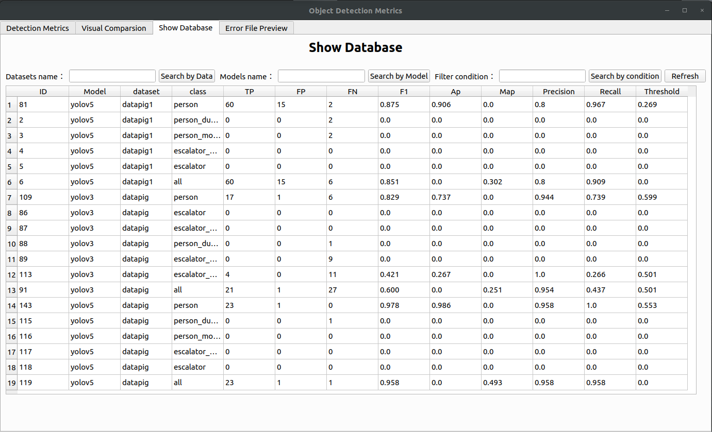
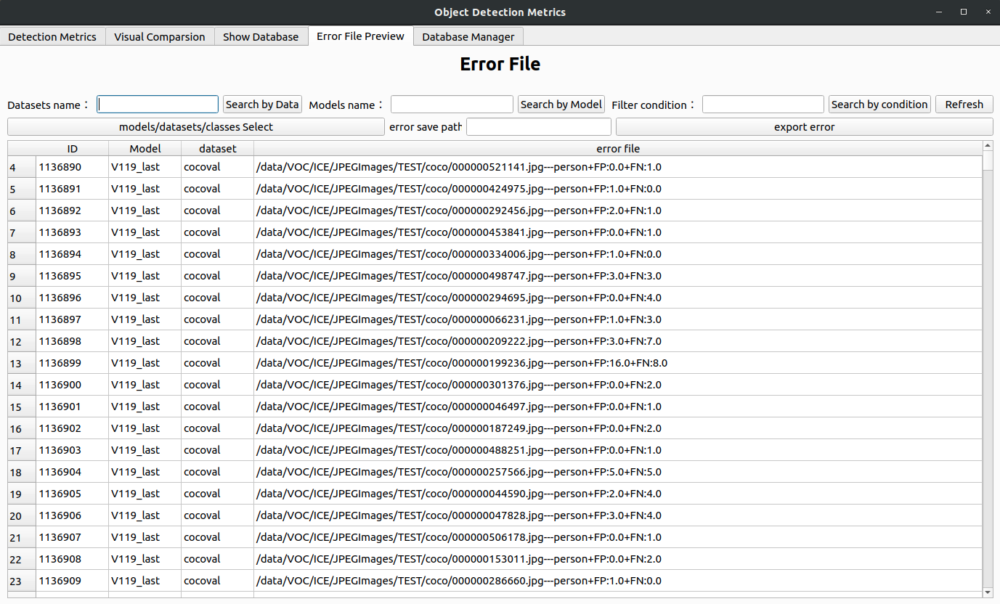

# object_detection_evaluation
1.主界面（测评界面）：

2.结果可视化页面：

3.表格展示页面：

4.错误文件界面：

## 代码规范
#### 函数名称：string stringString小驼峰 或者 _string_string 【动词性质】
#### 变量名称：string string_string 【名词性质】
#### 类名：StringString大驼峰
#### 文件名：string 或者 string【小写】 + 下划线
#### 文件夹名：string【小写】