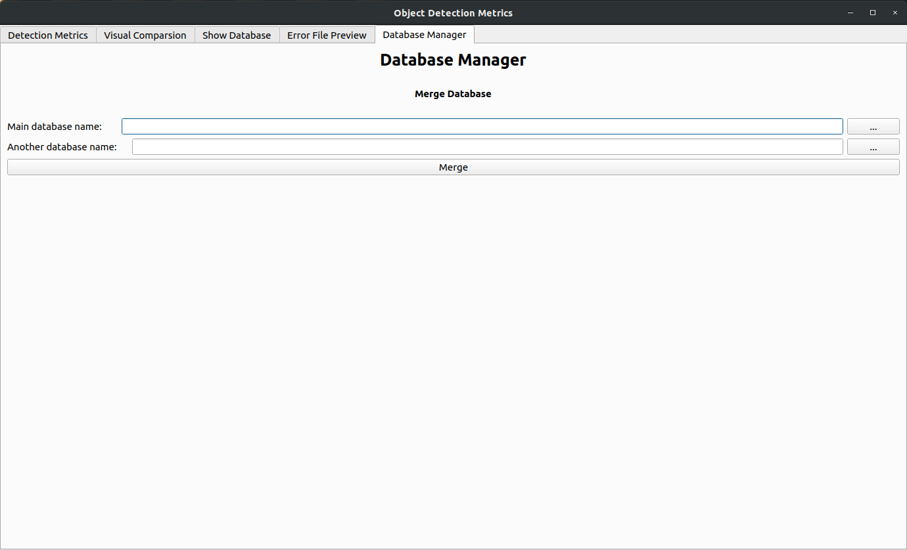

# object_detection_evaluation
###1.运行环境
```sybase
主要环境：
onnx
onnxruntime-gpu
Pyqt5
```
###2.主界面（测评界面）：

**选择model（onnx） images Classes format 预处理方式 数据集名字 点击RUN即可**


2.结果可视化页面：

**与界面3联动，可进行可视化对比**


3.表格展示页面：

**Model/dataset/classes Select：弹出对话框，实现对比实验结果展示**    
**search by Selections：调节为最优F1下的指标**   
**refresh by threshold0.8：调节为0.8阈值下的指标**


4.错误文件界面：

**按钮1选择要导出的指定实验的错误列表   导出路径    开始导出**


5.数据库管理界面：

**当前只支持数据库合并操作**



### 3.代码规范
#### 函数名称：string stringString小驼峰 或者 _string_string 【动词性质】
#### 变量名称：string string_string 【名词性质】
#### 类名：StringString大驼峰
#### 文件名：string 或者 string【小写】 + 下划线
#### 文件夹名：string【小写】