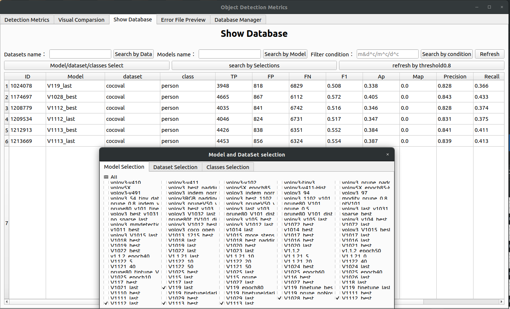

# object_detection_evaluation
1.主界面（测评界面）：

2.结果可视化页面：
Draw by Data:输入数据集名称，可视化不同的模型在此数据集上的结果对比
Draw by Model:输入模型名称，可视化此模型在不同数据集上的结果对比

当输入数据集名称或模型名称点击load，可以把根据data或model名称查询到的每一行数据对应的类别加载到combox中。点击切换类别，可以可视化每一类的结果对比

3.表格展示页面：
排序：点击表头即可排序
筛选：1.根据data name筛选出所有模型在此数据集上的结果
           2.根据model name筛选出该模型在所有数据集上的结果
           3.根据条件语句查询：例如(Ap>0.5),即可查询Ap大于0.5的数据条目

4.错误文件界面：功能正在实现